# Designing and Implementing a 3-Tier Architecture with Terraform, Ansible, Prometheus and Grafana

## Project Overview
This project demonstrates how to design and implement a **3-tier architecture** using **Infrastructure as Code (IaC)** and **Configuration Management** tools.

The infrastructure is provisioned using **Terraform**, and the servers are configured using **Ansible**.

The architecture consists of:

- 1 Load Balancer
- 2 Web Servers
- 1 Monitoring Server (Prometheus + Grafana)
- Ubuntu 22.04 Virtual Machines
- Nginx Web Server

Traffic from clients is routed through the **Load Balancer**, which distributes requests between the two web servers.  
Monitoring and visualization are handled using **Prometheus and Grafana**.

---

# Tools & Technologies

- Terraform
- Ansible
- VirtualBox
- Ubuntu 22.04
- Nginx
- Prometheus
- Grafana
- Git & GitHub
- SSH

---

# Architecture

The architecture distributes traffic across multiple servers and monitors infrastructure performance.

Client → Load Balancer → Web1 / Web2  
Prometheus → Monitoring Service  
Grafana → Visualization Dashboard

---

# Git Configuration with SSH

### 1. Check Git installation
```
git --version
```

### 2. Configure Git username and email
```
git config --global user.name "Your Name"
git config --global user.email "your-email@example.com"
```

### 3. Generate SSH key
```
ssh-keygen -t ed25519 -C "your-email@example.com"
```

### 4. Start SSH agent
```
eval "$(ssh-agent -s)"
```

### 5. Add SSH key to agent
```
ssh-add ~/.ssh/id_ed25519
```

### 6. Display public SSH key
```
cat ~/.ssh/id_ed25519.pub
```

Copy the key and add it to:

GitHub → Settings → SSH and GPG Keys → New SSH Key → Paste key

### 7. Test SSH connection
```
ssh -T git@github.com
```

### 8. Initialize Git repository
```
git init
```

### 9. Add README file
```
git add README.md
```

### 10. Commit the file
```
git commit -m "Initial commit"
```

### 11. Set main branch
```
git branch -M main
```

### 12. Connect GitHub repository
```
git remote add origin <repository-url>
```

### 13. Push project to GitHub
```
git push -u origin main
```

---

# Terraform Configuration

### 1. Install Terraform
```
brew tap hashicorp/tap
brew install hashicorp/tap/terraform
```

### 2. Verify installation
```
terraform -version
```

### 3. Create Terraform project folder
```
mkdir terraform
cd terraform
```

### 4. Create Terraform configuration file
```
touch main.tf
```

### 5. Initialize Terraform
```
terraform init
```

### 6. Check execution plan
```
terraform plan
```

### 7. Apply configuration (create infrastructure)
```
terraform apply
```

### 8. Verify resources
```
terraform state list
```

---

# Ansible Configuration

### 1. Install Ansible
```
brew install ansible
```

### 2. Verify installation
```
ansible --version
```

### 3. Create Ansible project folder
```
mkdir ansible
cd ansible
```

### 4. Create inventory file
```
touch inventory.ini
```

### 5. Add server IPs to inventory
```
nano inventory.ini
```

### 6. Test connection to servers
```
ansible all -i inventory.ini -m ping
```

### 7. Create Ansible configuration file
```
touch ansible.cfg
```

### 8. Create playbook
```
touch playbook.yml
```

### 9. Run Ansible playbook
```
ansible-playbook -i inventory.ini playbook.yml
```

### 10. Install Prometheus and Grafana
```
ansible-playbook -i inventory.ini monitoring.yml -K
```

---

# Project Screenshots

## VirtualBox Instance
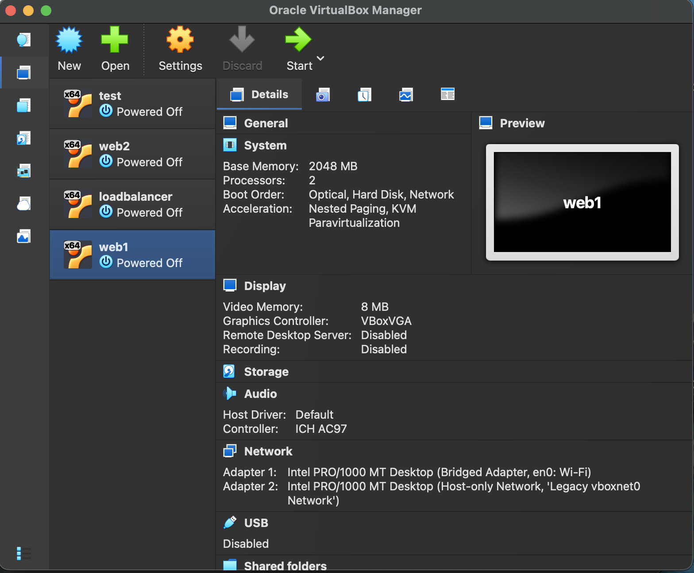

## Ubuntu Installation


## SSH Error
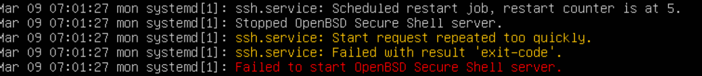


## Deploy Custom HTML
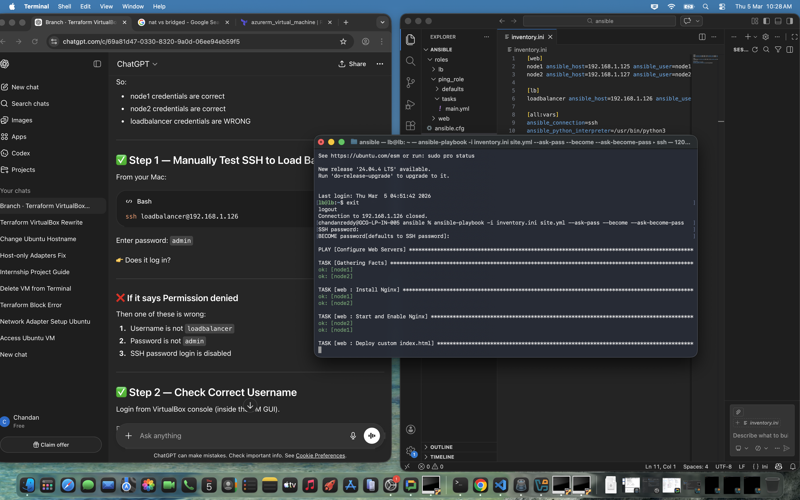

## Install Nginx
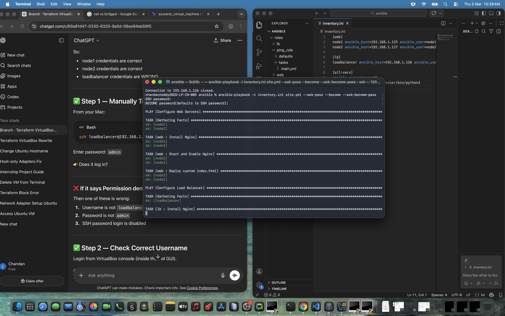

## Load Balancer Page
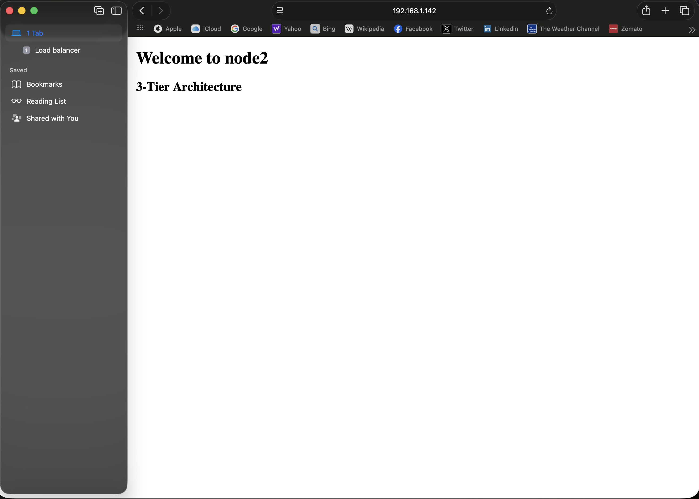

## Node1 IP
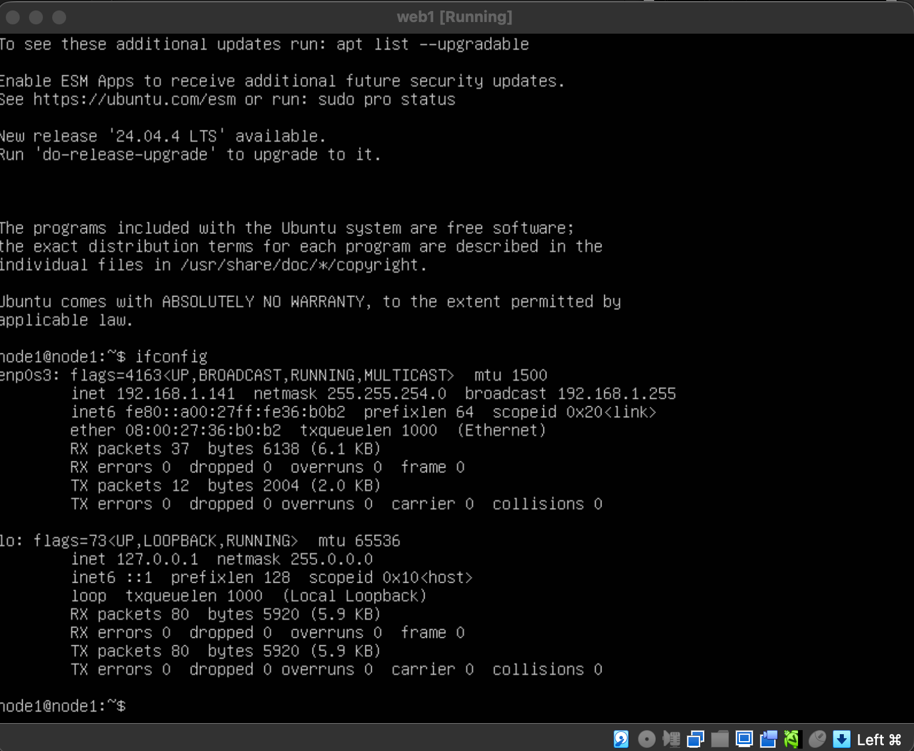

## Node1 Page
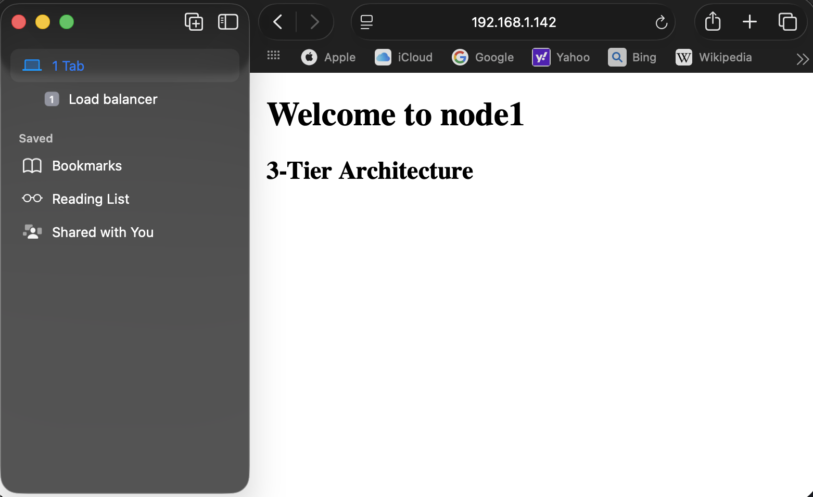

## Node2 IP
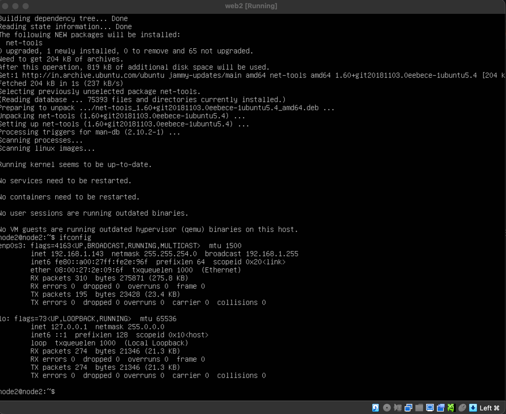

## Node2 Page


---

# Monitoring Setup

## Grafana Dashboard
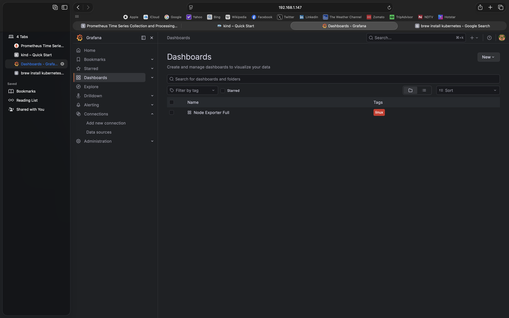

## Grafana Connected with Prometheus
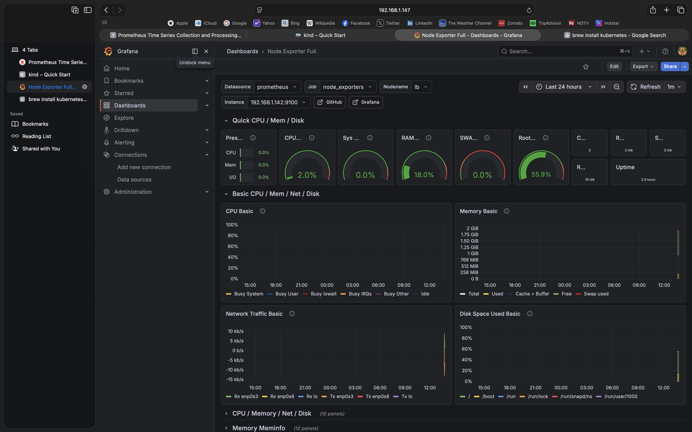

## Prometheus Dashboard
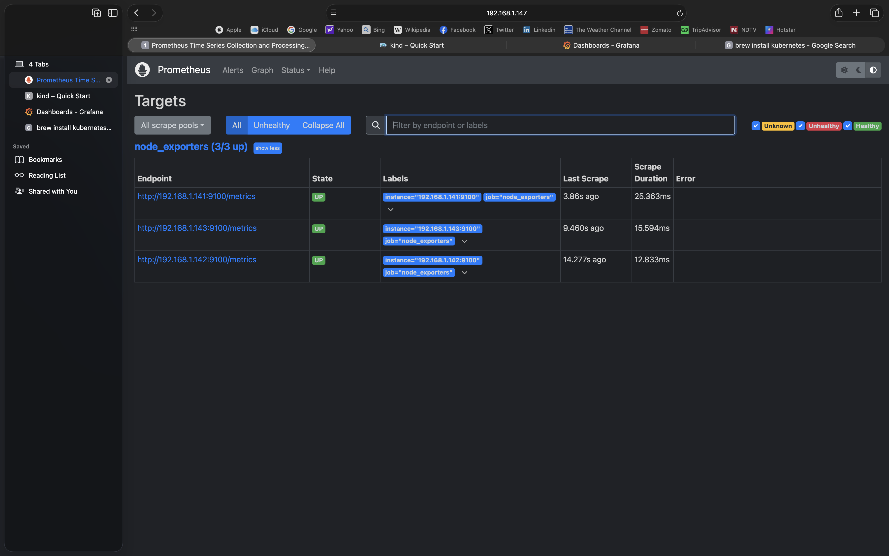

---

# Conclusion

This project demonstrates how **Infrastructure as Code and Automation tools** can be used to build scalable and automated infrastructure.

Key achievements:

- Infrastructure provisioning using Terraform
- Configuration management using Ansible
- Nginx Load Balancer implementation
- Deployment of two web servers
- Monitoring using Prometheus
- Visualization using Grafana

This architecture provides a **scalable, automated, and monitored web infrastructure environment**.


